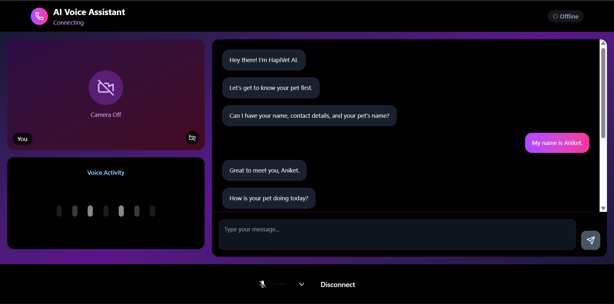
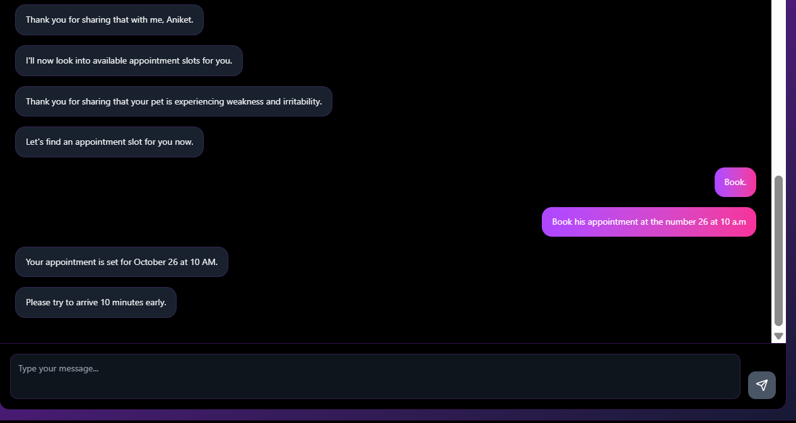
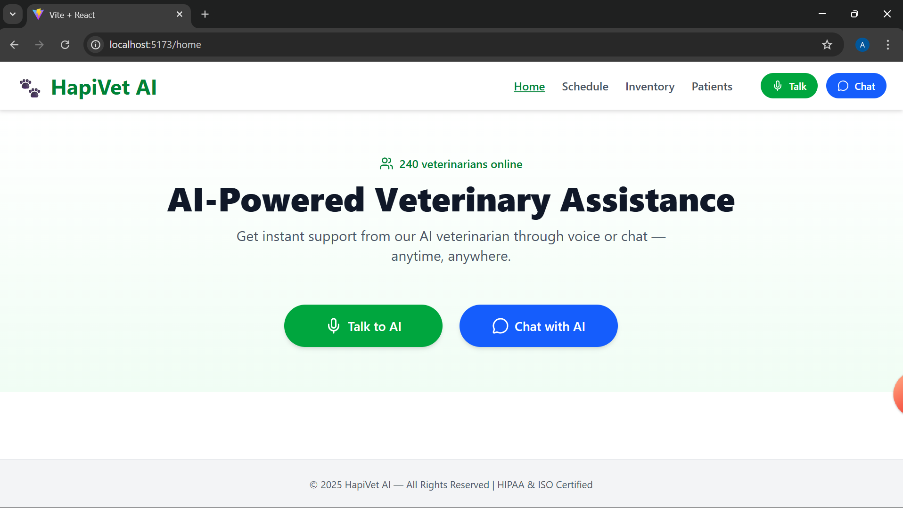
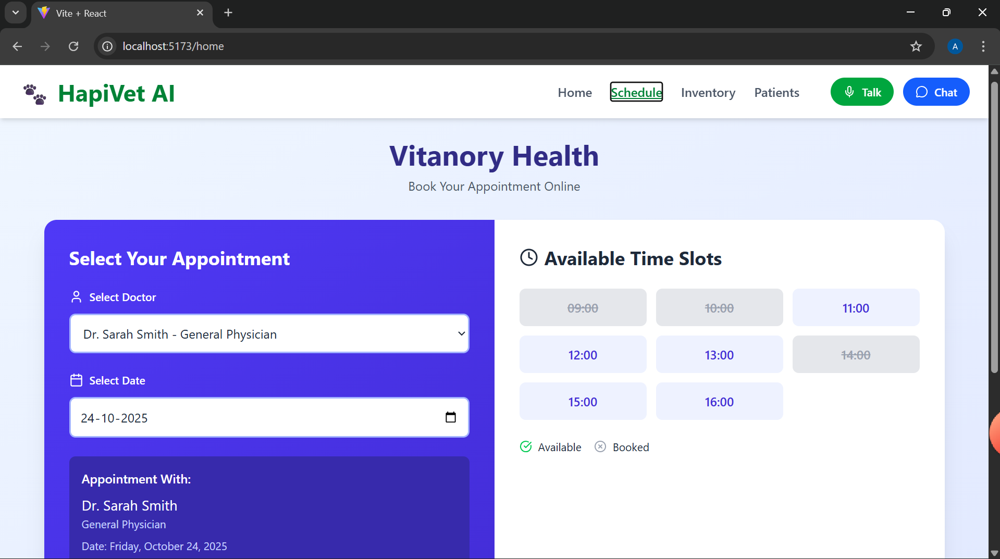
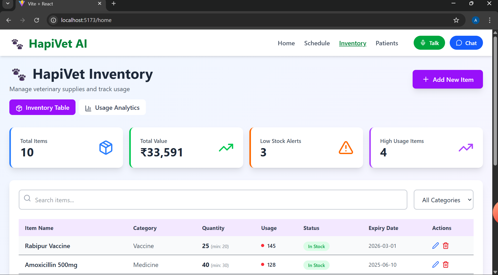
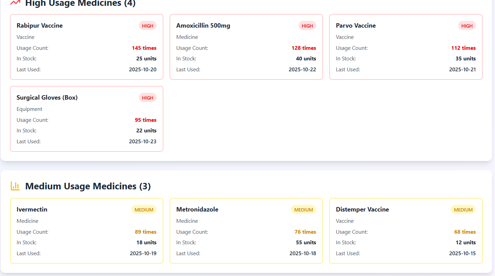
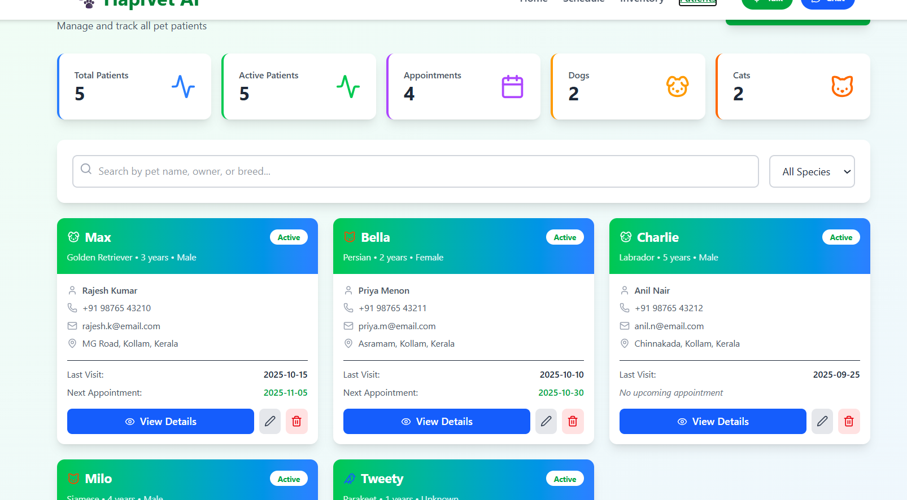
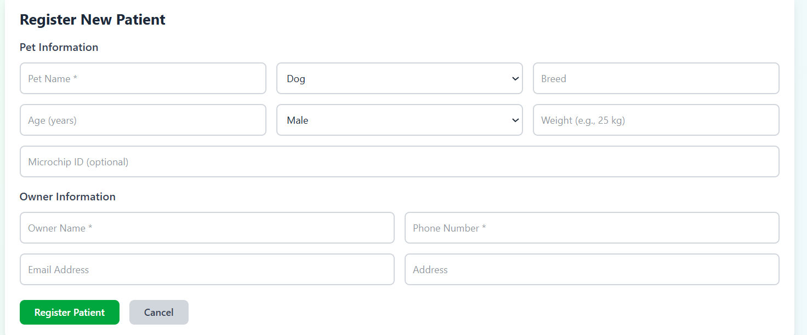

# HapiVet AI

**Team Name:** TeamANVY

**Project Type:** AI-Powered Veterinary Assistant

---

## 1. Problem Statement

HapiVet AI is an intelligent AI-powered assistant designed to manage and streamline veterinary clinic operations. The system aims to:

* Collect and store **user (pet owner) and patient (pet) details**.
* Identify and diagnose **possible diseases** using AI/ML-based symptom analysis.
* Handle **emergencies** by automatically initiating calls to responsible personnel.
* Provide a **Schedule page** showing all doctors, available slots, and booked appointments.
* Maintain a **dynamic inventory page** displaying medicine items, vaccines, supplements, equipment, and stock levels.
* Show a **Patients page** with detailed information about each patient.
* Automate navigation and task execution **without human intervention**.

HapiVet AI ensures smoother operations, faster response in emergencies, and better decision-making using **machine learning** and AI-driven automation.

---

## 2. Tools / Technologies Used

### **Frontend**

* **React.js / Vite** – For building a responsive and dynamic interface.
* **React Router** – For navigation between pages: Home, Schedule, Inventory, Patients.
* **WebSocket / LiveKit** – To enable real-time communication between the AI assistant and the frontend.


### **Backend**

* **Python** – Core language for AI, ML, and server-side logic.
* **FastAPI** – To create REST APIs for frontend-backend communication.
* **MongoDB** – Database for storing user, patient, schedule, and inventory data.

### **Machine Learning Approaches**

1. **Disease Prediction / Diagnosis**

   * **Approach:** Symptom-based classification using models like Random Forest.
   * **Data:** Historical patient records with symptoms and confirmed diagnoses.
   * **Purpose:** Given the symptoms input by the AI assistant, the system predicts the probable disease for the patient.

2. **Schedule Optimization**

   * **Approach:** Use a **ML-based recommendation system** to suggest optimal time slots for doctors based on availability and demand patterns.
   * **Data:** Doctor schedules, appointment history, and slot popularity.

3. **Inventory Management**

   * **Approach:** Predictive stock management using **time-series forecasting** (LSTM) to estimate when a medicine or equipment will run low.
   * **Purpose:** Dynamically updates inventory, highlights low-stock items, and forecasts future needs.

4. **AI Assistant Automation**

   * **Approach:** NLP-based intent recognition using **OpenAI GPT models, BERT** to understand commands and execute tasks such as page navigation, calling, or booking.
   * **Purpose:** Automates tasks without human intervention and responds to user queries efficiently.

### **Other Tools**

* **Twilio / VoIP API** – For emergency call functionality.
* **Pandas / NumPy / Scikit-learn / TensorFlow / PyTorch** – For ML model training, prediction, and data manipulation.

---

## 3. Code Overview

### **Frontend Navigation Example (React + AI Assistant)**

```jsx
import { useNavigate } from "react-router-dom";
import { useEffect } from "react";

export default function AssistantListener({ command }) {
  const navigate = useNavigate();

  useEffect(() => {
    if (!command) return;
    switch(command.page) {
      case "home": navigate("/"); break;
      case "schedule": navigate("/schedule"); break;
      case "inventory": navigate("/inventory"); break;
      case "patients": navigate("/patients"); break;
      default: break;
    }
  }, [command, navigate]);

  return null;
}
```

### **Backend Emergency Call Example (Python)**

```python
from twilio.rest import Client

def make_emergency_call(to_number):
    account_sid = "your_twilio_sid"
    auth_token = "your_twilio_token"
    client = Client(account_sid, auth_token)

    call = client.calls.create(
        twiml='<Response><Say>Emergency! Please respond immediately.</Say></Response>',
        to=to_number,
        from_='+1234567890'
    )
    return call.sid
```

### **ML Example: Disease Prediction**

```python
from sklearn.ensemble import RandomForestClassifier
import pandas as pd

# Load dataset of symptoms and diseases
data = pd.read_csv("patient_data.csv")
X = data.drop("disease", axis=1)
y = data["disease"]

model = RandomForestClassifier()
model.fit(X, y)

# Predict disease based on new symptoms
new_symptoms = [[1, 0, 1, 0]] # Example symptom vector
predicted_disease = model.predict(new_symptoms)
print("Predicted Disease:", predicted_disease[0])
```

---

### Summary of Pages and Features

| Page         | Feature                                                                                |
| ------------ | -------------------------------------------------------------------------------------- |
| Home         | Overview and AI assistant interface                                                    |
| Schedule     | Show doctors, available slots, booked slots; ML-based slot recommendations             |
| Inventory    | Shows medicines, vaccines, supplements, equipment, stock levels; predictive restocking |
| Patients     | Detailed patient info, past history, predicted diseases                                |
| AI Assistant | Automates navigation, schedules, emergency calls, and general queries                  |

---

**LiveKit** is an **open-source real-time communication (RTC) platform** designed for building scalable audio, video, and data streaming applications. It provides APIs and SDKs for multiple platforms including **Web, iOS, Android, and Node.js**, enabling developers to implement **real-time audio/video calls, screen sharing, and messaging** with low latency. In the context of a veterinary AI assistant, LiveKit can be leveraged to create a seamless **voice-based interface**, allowing users to interact with the system using **audio input (speech-to-text)** and receive responses in **audio output (text-to-speech)**.  

To build such a system, several components and tools are integrated alongside LiveKit:  

1. **Voice Interaction**: LiveKit handles the streaming of audio from the user to the server. A **speech-to-text (STT) engine** like OpenAI’s Whisper or Google Speech-to-Text converts user audio into text. Responses generated by the AI are then converted back into audio using a **text-to-speech (TTS) engine** such as Silero TTS or ElevenLabs API, which is then streamed back to the user via LiveKit.  

2. **Patient Data Collection**: The system collects information about pets (dogs, cats) and their owners, including **name, contact details, pet age, breed, symptoms, and medical history**. This data can be stored in a **database** such as MySQL, PostgreSQL, or MongoDB for structured retrieval.  

3. **Disease Identification and Guidance**: Using **machine learning models** trained on veterinary health data, the system can analyze the reported symptoms to suggest **possible diseases**, **precautions**, and **prevention tips**. For example, it can recommend vaccination schedules, hygiene practices, or immediate care measures.  

4. **Appointment Scheduling**: LiveKit can integrate with a scheduling module that checks **doctor availability** and displays **free and booked slots**. Users can book appointments in real-time, and the backend updates the availability dynamically.  

5. **Navigation and Assistance**: The AI assistant can guide users through the platform, providing instructions on filling forms, accessing pet health information, or navigating the schedule page. This can be enhanced using **interactive voice commands** supported by LiveKit’s audio streaming capabilities.  

6. **Technical Architecture**:  
   - **Frontend**: Web or mobile app interface for interacting with the AI assistant.  
   - **LiveKit Server**: Handles all real-time audio/video streams.  
   - **AI Layer**: NLP and ML models for understanding queries, generating responses, and disease prediction.  
   - **Database**: Stores pet and owner information, appointments, and historical data.  
   - **Integration**: APIs connect the AI layer, LiveKit, and the database to provide a seamless experience.

  
   

   
   
   
   
   
   
   
   

  
     

**Team Name:** TeamANVY
**Project Goal:** Fully automated AI-powered veterinary assistant that reduces human effort, optimizes operations, and provides real-time actionable insights.

